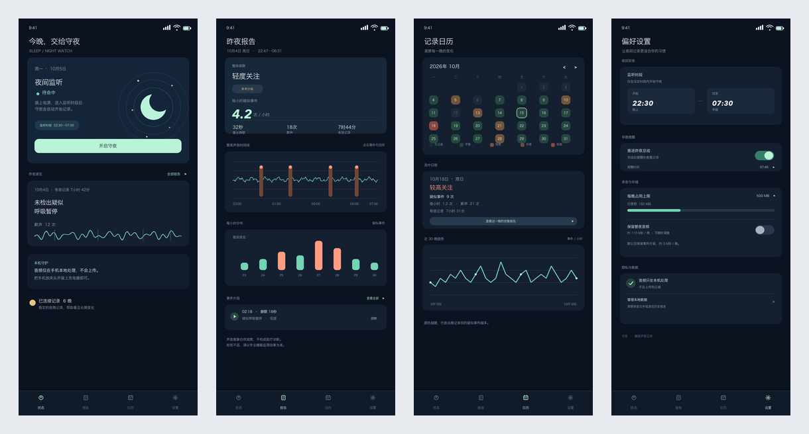
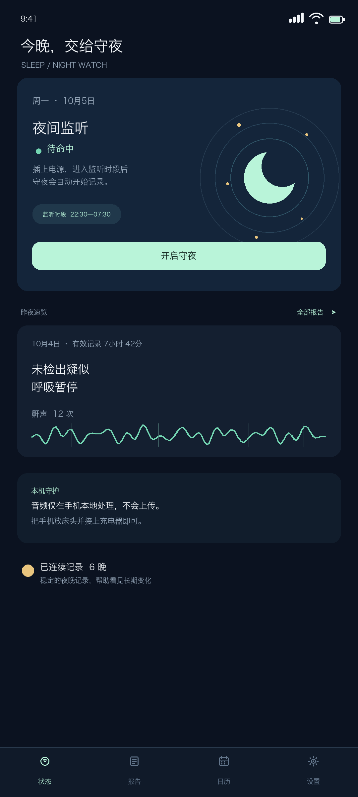
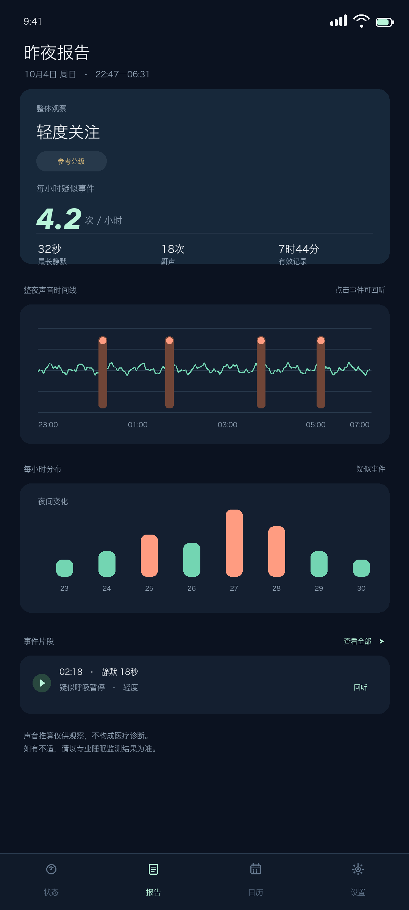
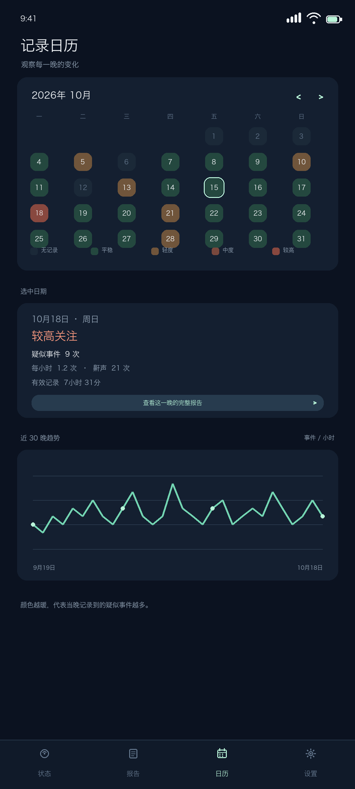
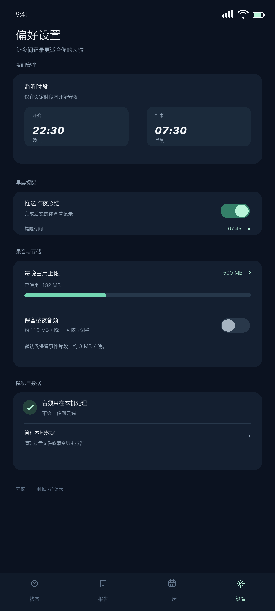

# 守夜 · SleepSentry

用手机麦克风记录整夜睡眠声音的安卓 App。插上电、放床头、什么都不用做，第二天早上收到一份报告。

回答四个问题：**什么时候憋的 · 憋了几次 · 每次多长 · 严重到什么程度**

> ⚠️ **不是医疗器械，不做疾病诊断。**
> 本项目依据麦克风采集到的声音推算"疑似呼吸暂停事件"的次数与分布，
> **无法反映血氧与中枢性呼吸事件**，不能替代医院的多导睡眠监测（PSG/HSAT）。
> 请以医院检查结论为准。



---

## 目录

- [它做什么](#它做什么)
- [快速开始](#快速开始)
- [界面](#界面)
- [核心设计：为什么是"持续监听 + 择要留存"](#核心设计为什么是持续监听--择要留存)
- [算法与验证](#算法与验证)
- [工程要点](#工程要点)
- [已知局限（诚实版）](#已知局限诚实版)
- [项目结构](#项目结构)
- [License](#license)

---

## 它做什么

| 能力 | 说明 |
|---|---|
| **持续监听** | 麦克风整夜常开，全程累计计数 —— 次数一次不漏 |
| **择要留存** | 只保存事件前后片段，默认约 **3MB/晚**（全量录音是它的 300 倍） |
| **自动启动** | 插上充电器且进入时段即开始待命，每晚零操作 |
| **事件回放** | 每个疑似事件都能点开听原声，看得见摸得着 |
| **日历色块** | 每月一格，颜色越暖表示当晚越严重 |
| **每小时分布** | 柱状图看清"是不是后半夜更糟" |
| **长期趋势** | 一切对比都跟自己比，不跟别人比 |
| **存储配额** | 每晚上限可调（50MB ~ 1GB 或不限），超出自动删最旧 |
| **纯本地** | **没有申请 INTERNET 权限**，音频不出手机 |

---

## 快速开始

### 安装

从 [Releases](https://github.com/zhbcher/sleep-sentry/releases) 下载 APK，或自行构建：

```bash
adb install -r app-debug.apk
```

### 首次使用（三步）

1. 允许**麦克风权限**与**通知权限**
2. 点「开启守夜」，按提示**关闭电池优化**（不关的话国厂 ROM 录不到一小时就会杀进程）
3. 睡前把手机**接上充电器**放床头，第二天早上收推送

### 自行构建

```bash
# 依赖：JDK 17 + Android SDK（platforms;android-35, build-tools;35.0.0）
export JAVA_HOME=/path/to/jdk-17
echo "sdk.dir=$ANDROID_HOME" > android/local.properties

cd android
./gradlew testDebugUnitTest     # 72 个单元测试
./gradlew assembleDebug         # 产出 debug APK
```

---

## 界面

| 状态 | 报告 | 日历 | 设置 |
|---|---|---|---|
|  |  |  |  |

设计稿源文件在 [`android/UI设计稿/`](android/UI设计稿/)。

---

## 核心设计：为什么是"持续监听 + 择要留存"

早期方案曾采用"哨兵模式"（检测到异常才记录），**被否决了**：

> 呼吸暂停的异常是**没有声音**。你没法对"没声音"触发录音 ——
> 必须先一直听着，才知道这段安静从什么时候开始、持续多久。
> 而且要回答"憋了几次"，必须一秒不落地连续计时；
> 触发式会漏数，漏了还**无法区分"真没发生"和"没录到"**。

**监听与保存必须解耦：要"数"的必须一直听，要"存"的才可以有选择。**

```
麦克风 16kHz 全程常开
  ├─ 实时累计（零落盘）：呼吸峰序列、静默段起止与时长、每秒信噪比
  └─ 择要落盘：事件前 10s + 后 5s / 每小时 1 个环境采样 / 手动收藏
```

---

## 算法与验证

### 检测链路

```
100ms 子帧 RMS → 20 秒滑窗 P15 自适应噪声底
  → RBJ 高通100Hz + 低通4kHz
  → 不对称去抖动迟滞状态机（转"有声"0.2s / 转"静默"0.6s）
  → 静默段 ≥10s（临床定义）且 ≤60s，且被一次"瞬态"呼吸结束 → 记为一次事件
```

两个反直觉但关键的设计：

- **去抖必须不对称**。恢复性喘息可能只有 0.2 秒高信噪比；要求对称的 0.5 秒会让召回从 95% 掉到 62%。
- **"恢复性喘息"必须是瞬态而非台阶**。一次吸气 1~2 秒回到底噪，电视/空调突然开起来会持续几十秒。
  不加这条判据，环境噪声的一起一落会被凭空当成事件。

### 合成音频金标准（7 种环境条件）

| 指标 | 验收线 | 实测 |
|---|---|---|
| 事件召回 | ≥90% | **100%**（7/7 组） |
| 计数准确率 | ≥95% | **100%** |
| 起点误差中位 | ≤0.5s | **0.04–0.18s** |

复现：

```bash
cd dsp && python3 run_gold.py            # Python 参考实现
cd android && ./gradlew testDebugUnitTest # Kotlin 生产实现
```

两侧阈值必须同步修改，各自跑测试，出现分歧即为回归。

### 真实数据验证：一次有价值的失败

用真实数据集（APSAA，32 人整夜录音 + 临床标注）测试，最佳 F1 只有 **35.7%**。
排查后确认**不是算法问题**：

- 音频包络与临床鼾声标注的相关系数 **-0.012**
- 五个频带的可分性（效应量）全部 **< 0.7**，低于可分阈值
- 结论：**那份录音的麦克风离患者太远，房间里根本没有录到可用的鼾声信息**

任何检测器（含 DNN）在该数据上都接近随机。详见 [`dsp/GOLD_STANDARD.md`](dsp/GOLD_STANDARD.md)。

---

## 工程要点

| 点 | 做法 |
|---|---|
| 做到"每晚零操作" | 靠 `ACTION_POWER_CONNECTED` 广播拉起前台服务，**不用 App 自我后台唤醒** |
| 息屏不断录 | `PARTIAL_WAKE_LOCK` + 前台服务 `foregroundServiceType="microphone"` |
| 录不出底噪 | 依次尝试 `UNPROCESSED` → `VOICE_RECOGNITION` → `MIC` |
| **关闭 AGC** | 自动增益会抹掉鼾声的动态范围，而那正是要测的信号 |
| 断档自检 | 运行失败时记录原因并推送告知 —— 用户必须知道为什么没数据 |
| 内存安全 | 整夜音频**流式落盘**而非攒在内存（8 小时约 900MB，必然 OOM） |

### 安卓版本约束

| 版本 | 要求 |
|---|---|
| API 28 (9) | `foregroundServiceType="microphone"` 必填 |
| API 29 (10) | 后台不能启动前台服务 → 必须用户点一次完成授权绑定 |
| API 33 (13) | `POST_NOTIFICATIONS` 运行时权限 |
| API 34 (14) | `FOREGROUND_SERVICE_MICROPHONE`；无 `RECORD_AUDIO` 直接抛异常 |
| API 35 (15) | 后台启动 mic 前台服务抛异常；**开机后禁止**自动启动麦克风前台服务 |

---

## 已知局限（诚实版）

1. **真实准确率尚未被证明。** 合成数据上的 100% 只验证了计数与计时逻辑正确。
   决定性实验是「手机放床头 + 家用睡眠监测仪配对实测」，尚未做。
2. **不重度打鼾的人群漏报率高** —— 方法靠"鼾声消失"观测气流中断，无鼾声则无信号。
3. **中枢性呼吸暂停检测不到** —— 无鼾声恢复期，与"安静睡觉"声音上无法区分。
4. **恒定环境噪声（风扇/空调嗡鸣）会掩盖鼾声** —— 在能量上与"安静"无法区分。
5. **噪声越大，计时越不准** —— 3 倍噪声下起点误差最大 2.4s，安静房间 0.05–0.2s。
6. **国厂 ROM 后台限制是头号工程风险** —— 未在三款主流机型上完成 7 晚连续实测。

---

## 项目结构

```
sleep-sentry/
├── android/
│   ├── app/src/main/kotlin/com/sleepsentry/
│   │   ├── dsp/          核心算法（纯 Kotlin，无 Android 依赖，可 JVM 测）
│   │   ├── capture/      前台服务、充电自启、环形音频缓冲
│   │   ├── store/        记录仓库、存储配额、文件名规范
│   │   ├── ui/           四个页面 + 自绘图表
│   │   └── util/         配置、PCM 回放
│   ├── app/src/test/     72 个单元测试
│   └── UI设计稿/          设计稿
├── dsp/                  Python 参考实现 + 金标准测试 + 踩坑记录
└── README.md
```

**Python 与 Kotlin 两侧的算法阈值必须同步修改并各自跑测试。**

---

## License

[MIT](LICENSE) © 2026 zhbcher

验证用数据集 [APSAA](https://zenodo.org/records/14096541) 为 CC-BY-4.0，不随本仓库分发。